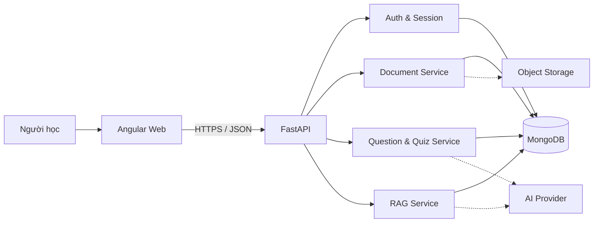

# Testora

[](https://github.com/DuyLinh0212/Testora/actions/workflows/ci-cd.yml)

Testora là hệ thống học tập giúp biến tài liệu thành bộ câu hỏi, tổ chức quiz, chấm điểm và theo dõi tiến độ. Dự án được tổ chức theo mô hình monorepo gồm Angular 20, FastAPI và MongoDB.

## Kiến trúc tổng thể



Frontend và API là hai đơn vị triển khai độc lập. Trình duyệt không kết nối trực tiếp tới cơ sở dữ liệu hoặc nhà cung cấp AI; toàn bộ quyền truy cập đi qua API.

## Mô-đun chức năng

| Mô-đun | Trách nhiệm |
|---|---|
| Identity | Đăng ký, đăng nhập, làm mới phiên, đăng xuất và đổi mật khẩu |
| Plans & Usage | Quản lý gói dịch vụ, hạn mức tài liệu và lượt tạo AI |
| Documents | Upload PDF/DOCX/TXT, trích xuất nội dung, lưu metadata và quản lý vòng đời |
| Question Banks | Import câu hỏi, tạo câu hỏi từ tài liệu, chỉnh sửa và phân loại |
| AI Jobs | Xử lý tác vụ tạo câu hỏi theo batch, cập nhật tiến độ và trạng thái |
| RAG | Chia đoạn tài liệu, truy hồi nội dung liên quan và tạo câu trả lời có ngữ cảnh |
| Quizzes | Tạo quiz, mã chia sẻ, xáo câu hỏi/lựa chọn và quản lý lượt làm |
| Results | Chấm điểm, giải thích đáp án, câu sai cần ôn và leaderboard |
| Web App | Dashboard, tài liệu, ngân hàng câu hỏi, quiz, kết quả và bảng giá |

## Thuật toán và phương pháp

### 1. Xác thực và vòng đời phiên

Mật khẩu được chuyển thành hàm băm một chiều. Sau khi xác thực, API cấp access token ngắn hạn và refresh token dài hạn. Bản định danh của refresh token được lưu dưới dạng digest để hỗ trợ thu hồi phiên mà không lưu token nguyên bản.

```text
credentials -> verify password hash -> issue token pair
refresh token -> verify type/expiry -> verify active session -> rotate token pair
logout -> revoke refresh session
```

### 2. Rate limiting theo fixed window

Mỗi request được ánh xạ vào một phạm vi như đăng nhập, upload, AI hoặc submit quiz. Cửa sổ thời gian được tính bằng:

```text
windowStart = epoch - (epoch mod windowSize)
counterKey  = identity + network + scope + windowStart
```

Bộ đếm được tăng atomically trong MongoDB. Bản ghi hết hạn tự động bằng TTL index. Cách làm có độ phức tạp trung bình `O(1)` cho mỗi request và xử lý được hai request đồng thời cùng tạo cửa sổ mới.

### 3. Hạn mức sử dụng atomic

Quota AI và rate limit là hai lớp độc lập. Quota phản ánh quyền lợi gói theo ngày; rate limit bảo vệ API trong cửa sổ ngắn. Thao tác `findOneAndUpdate` có điều kiện bảo đảm nhiều request song song không vượt hạn mức do race condition.

### 4. Trích xuất và chia đoạn tài liệu

Pipeline chuẩn hóa nội dung từ PDF, DOCX hoặc TXT, sau đó chia thành các chunk có kích thước giới hạn. Metadata vị trí được giữ cùng chunk để phục vụ truy hồi và dẫn chiếu. Question Bank có vòng đời độc lập, vì vậy xóa file nguồn không làm mất bộ câu hỏi đã tạo.

### 5. Sinh câu hỏi theo batch

AI job chuyển qua các trạng thái `PENDING -> PROCESSING -> COMPLETED/FAILED`. Câu hỏi được sinh theo batch nhỏ để giới hạn kích thước request, cập nhật phần trăm tiến độ và cho phép báo lỗi có cấu trúc. Output AI được kiểm tra bằng schema trước khi ghi vào database. Khi provider ngoài chưa được bật, adapter dự phòng xác định giúp luồng phát triển và kiểm thử vẫn hoạt động.

### 6. RAG với chiến lược fallback

RAG ưu tiên vector search khi có embedding và index tương ứng. Nếu vector search không khả dụng, hệ thống chuyển sang lexical retrieval.

Điểm lexical dùng độ phủ token có chuẩn hóa:

```text
overlap = sum(min(queryCount[token], documentCount[token]))
score   = overlap / sqrt(totalQueryTokens * totalDocumentTokens)
```

Các chunk có điểm cao nhất được đưa vào ngữ cảnh; mô hình chỉ trả lời dựa trên ngữ cảnh đã truy hồi. Với `n` chunk và tổng `m` token, fallback lexical có độ phức tạp gần `O(m + n log n)`.

### 7. Chấm quiz và leaderboard

Khi bắt đầu quiz, API chỉ trả nội dung và lựa chọn, không trả đáp án hoặc giải thích. Khi nộp bài, server đối chiếu theo danh sách câu hỏi đã khóa trong attempt:

```text
score = round(correct / total * 10, 2)
```

Submit sử dụng cập nhật có điều kiện `IN_PROGRESS -> SUBMITTED`, nhờ đó một attempt không bị chấm hai lần khi có request đồng thời. Leaderboard sắp xếp theo điểm giảm dần và thời gian hoàn thành tăng dần.

## Kỹ thuật thiết kế và kế thừa

- **Layered modules:** router tiếp nhận HTTP, service xử lý nghiệp vụ, adapter giao tiếp AI/storage và repository được thể hiện qua MongoDB collections.
- **Dependency Injection:** FastAPI cung cấp database/current user; Angular dùng `inject()` cho HTTP, auth và routing guard.
- **Adapter pattern:** AI và storage có interface hành vi ổn định, cho phép đổi provider mà không thay đổi router.
- **Strategy + fallback:** vector retrieval chuyển sang lexical retrieval; AI bên ngoài chuyển sang deterministic fallback trong môi trường phát triển.
- **Schema-first validation:** các request/response nghiệp vụ kế thừa `Pydantic BaseModel`; validator bảo đảm đáp án đúng tồn tại trong options.
- **Exception inheritance:** lỗi nghiệp vụ kế thừa exception chuẩn và được ánh xạ thành JSON error thống nhất.
- **Composition over inheritance:** Angular ghép page, shell, service, guard và interceptor thay vì tạo cây lớp UI sâu.
- **Lazy loading:** route Angular tải page theo nhu cầu để giảm bundle ban đầu.

## Công nghệ sử dụng

| Lớp | Công nghệ |
|---|---|
| Web | Angular 20, TypeScript, RxJS, Angular Router, HttpClient |
| UI | CSS thuần, responsive layout, system fonts, reduced-motion |
| API | Python 3.12, FastAPI, Uvicorn, Pydantic |
| Data | MongoDB, PyMongo Async API, TTL/unique/compound indexes |
| Security | JWT, Argon2 password hashing, resource ownership checks, CORS, rate limiting, signed payment webhook |
| Documents | pypdf, python-docx, multipart upload |
| AI | Structured generation, embeddings, vector/lexical retrieval |
| Testing | Pytest, Jasmine/Karma, Chrome Headless, Playwright local QA |
| Delivery | GitHub Actions, Vercel CLI, Vercel project configuration |
| Payment | VietQR checkout, SePay API-key webhook, idempotent order fulfillment |

Font giao diện chỉ dùng font hệ thống (`Segoe UI`, `Arial`, `Consolas` và các fallback tương đương), không tải font thương mại.

## Cấu trúc thư mục

```text
Testora/
├── .github/workflows/ci-cd.yml
├── .github/scripts/scan_secrets.py
├── Testora_api/
│   ├── app/
│   │   ├── routers/
│   │   └── services/
│   └── tests/
├── Testora_web/
│   └── src/app/
├── vercel.json
└── README.md
```

## License

Source code thuộc dự án Testora. Các dependency bên thứ ba tuân theo license tương ứng trong package registry; giao diện không đóng gói font thương mại.
